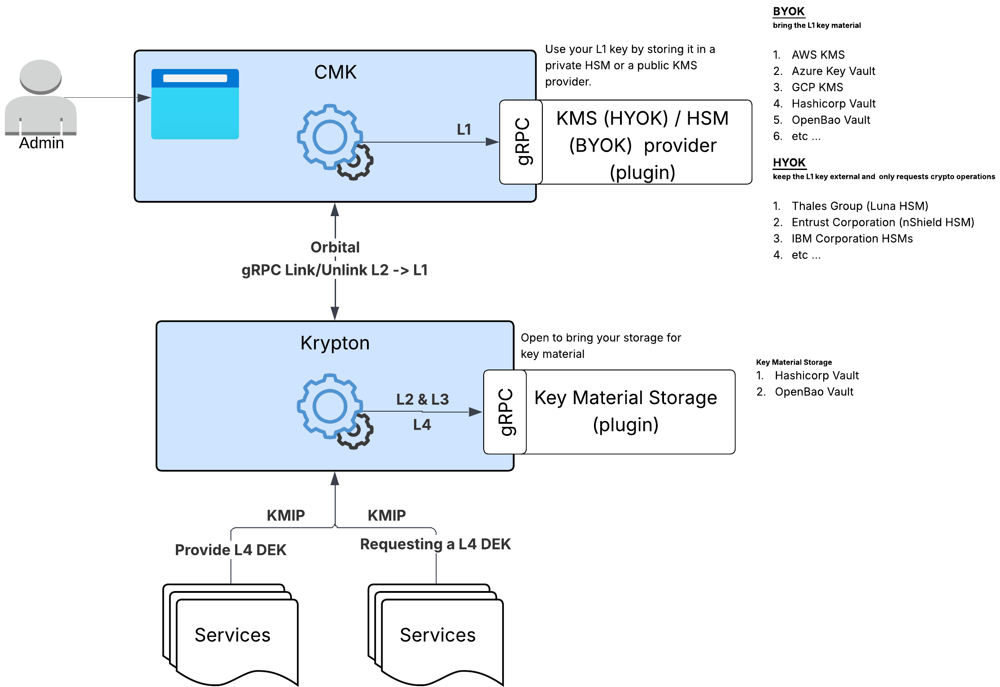

# ACD-100: OpenKCM Strategic Vision & Cryptographic Governance Model

| Status | Date | Document Type |
| :--- | :--- | :--- |
| **Active** | 2026-02-02 | Architecture Concept Design |

## Overview
**OpenKCM** is the **Value Engine** that enables platforms to win bigger deals, capture higher margins, and operate with zero-risk liability in a world that demands absolute data ownership.

In the modern sovereign-cloud era, traditional security is a cost center. OpenKCM transforms security into a **market differentiator** by solving the "Trust Paradox"—the conflict between providing total customer data ownership (Sovereignty) and the need for high-scale, cloud-native performance (Speed).

## Structural Pillar: The Governance & Execution Framework
To achieve absolute sovereignty without performance degradation, OpenKCM enforces a strict separation of duties between the logic of access (**Governance**) and the act of encryption (**Execution**).

### The Governance Control Plane (The Brain)
The Governance layer acts as the **source of intent**. It defines strict boundaries for **Identity** (Who) and **Sovereignty** (How), ensuring that policy is mathematically separated from the raw key material used in execution. It is structurally divided into two autonomous components:

#### CMK Registry: The Identity Authority
The Registry functions as the **Global Directory** and "Phonebook" of the platform. It is the single source of truth for the existence of a Tenant.
* **Tenant Lifecycle:** It is the master record for **Onboarding** (Provisioning) and **Offboarding** (Deprovisioning). No cryptographic entity can exist in the system without a valid Registry entry.
* **Lifecycle Triggers:** It drives the initialization of the data plane by emitting `Tenant.Create` or `Tenant.Delete` signals via **Orbital**. These signals instruct the Krypton Core to allocate or purge the secure memory structures required for L2/L3 keys.
* **Region Scope:** It enforces **Data Residency** by defining the specific geographical regions where a tenant is authorized to operate. The Krypton Core uses this scope to reject operations outside of the customer's legal jurisdiction.

#### CMK Server: The Sovereign Anchor
The CMK Server functions as the **Trust Broker** and "Vault Interface." It is the only component capable of bridging the internal system to the Customer's external Root of Trust.
* **L1 Pointer Management:** It securely stores the **Shadow Reference** (ARN, URL, or Resource ID) to the customer's External L1 Key (e.g., AWS KMS, Azure Key Vault). Crucially, it stores *only* the pointer, never the key itself.
* **Sovereign Linkage:** It is responsible for pushing the **L1 Pointer** and the **Link/Unlink** status events to the Krypton Core via **Orbital**, effectively "unlocking" the region for business.
* **The Kill-Switch (Revocation):** It provides the ultimate sovereignty control. When a customer initiates a revocation, the CMK Server broadcasts a high-priority `L1.Revoke` event. This forces the Krypton Core to immediately drop the L2 Tenant Key from memory, rendering all data indecipherable instantly.

### The Execution Plane (The Muscle)
The Execution layer handles the "operational reality" of cryptography. It is designed for zero-latency performance and autonomous security maintenance.

#### Krypton Core: The Regional Authority
The **Krypton Core** is the "Sovereign Hub" deployed per region. It is the sole authority for **Key Generation** and **Rotation**.
* **Sovereign Binding:** It uses the L1 Pointer (from CMK Server) to authenticate with the External Provider (via Plugins) and unseal the L2 Tenant Key.
* **Autonomous Lifecycle (L2/L3):**
  * **Creation:** Upon receiving a "Create" signal from the Registry, it generates the cryptographically strong L2/L3 key material.
  * **Rotation:** It owns the internal scheduler and executes **Key Rotation** for L2 and L3 keys autonomously, ensuring keys are always fresh without requiring instructions from the Control Plane.
* **Gateway Sealing:** It acts as the upstream root for the Krypton Gateways, securely delivering unwrapped L3 Service Keys to authorized nodes.

#### Krypton Gateway: The Edge Interface
The **Krypton Gateway** is the "High-Speed Switch" deployed close to the workload.
* **L4 DEK Factory:** Exclusively handles the generation, retrieval, and destruction of ephemeral **L4 Data Encryption Keys**.
* **Local Persistence:** Uses a **Pluggable Internal Vault** to cache L4 keys locally, ensuring that data plane operations (Encrypt/Decrypt) succeed even if the Core is temporarily unreachable.
* **KMIP Translation:** Exposes a standardized **KMIP** interface to applications.

## The Sovereignty Engine: Recursive Unsealing & Key Hierarchy
OpenKCM enforces security through a tiered key hierarchy where each layer is mathematically bound to the one above it.

* **L1 (External Root)**: Customer-owned (AWS/Azure/HSM). OpenKCM holds only a Reference (ARN).
* **L2 (Tenant Root)**: Intermediate key providing mathematical isolation. Unsealed only by the L1.
* **L3 (Service KEK)**: Isolates specific domains (e.g., "Payments," "Logs").
* **L4 (Data DEK)**: Ephemeral key for per-record encryption. Generated at the Gateway, wrapped by L3.

## Strategic Advantages

| Advantage | Business Meaning | Technical Enabler |
| :--- | :--- | :--- |
| **Market Expansion** | Opens Gov, Finance, Defense deals. | **L1 Root Control** (BYOK/HYOK) |
| **Liability Shift** | No plaintext root keys = Breaches are firewalled. | **Shadow Key Pattern** (Zero-Knowledge) |
| **Pricing Leverage** | Sell "Sovereign Revocation" as a Platinum Tier. | **Sovereign Kill-Switch** |
| **Competitive Moat** | True cryptographic isolation per tenant. | **Schema-per-Tenant** Architecture |
| **Compliance Speed** | Instant, non-repudiable audit trails. | **Sovereign Audit** (Correlation IDs) |

## Operational Capabilities

### CMK Layer: The Trust Firewall
The CMK Server acts as the centralized trust broker, ensuring that every interaction is authenticated, authorized, and physically isolated before it ever reaches the cryptographic engine.

* **Self-Service Sovereign Onboarding**: Enterprises can autonomously link their external trust anchors (AWS KMS, Azure Key Vault, or On-Prem HSMs) via the **CMK Server**. This "Bring Your Own Key" (BYOK) and "Hold Your Own Key" (HYOK) workflow validates ownership without ever exposing the raw key material to the SaaS provider.
* **Strict Schema-Based Isolation**: The **CMK Server** enforces a hard multi-tenancy model by interacting exclusively with dedicated per-tenant schemas. This guarantees that tenant metadata and policy configurations are cryptographically and logically segregated at the persistence layer, eliminating the risk of cross-tenant data leakage.
* **Instant Global Revocation**: The **CMK Server** provides a "Sovereign Kill-Switch." When a customer initiates a revocation, the server broadcasts a high-priority `L1.Revoke` event via Orbital. This instantly severs the link between the external root and the internal execution plane, rendering all data undecryptable globally within milliseconds.

### Crypto Layer: The Performance Engine
The Crypto layer is engineered for high-velocity, zero-latency operations, ensuring that strict security requirements never become a bottleneck for application performance.

* **Advanced Secret Protection**: The **Krypton Core** utilizes **Shamir Secret Sharing (SSS)** to split its master sealing key among multiple operators or secure hardware enclaves. This "Glass Break" protocol ensures that no single administrator or compromised process can ever reconstruct the core's identity or access the raw key memory.
* **Autonomous Zero-Touch Maintenance**: The **Krypton Core** features a fully autonomous internal scheduler that manages the entire lifecycle of L2 and L3 keys. It executes rotation, versioning, and re-wrapping operations in the background without requiring manual intervention or upstream commands, ensuring keys remain cryptographically fresh without service interruption.
* **Resilient Edge Operations**: The **Krypton Gateway** decouples availability from connectivity. By utilizing a **Pluggable Internal Vault** (e.g., in-memory Redis, Encrypted SQLite), it caches active L3 service keys and locally persists L4 data keys. This allows the data plane to continue encryption and decryption operations with 100% availability, even during total control plane outages.

## Strategic Outcome
**How Governance (CMK) & Operations (Crypto) Drive Enterprise Value**

| Strategic Dimension | CMK (Registry & Server) | Crypto (Core & Gateway) | Combined Impact |
| :--- | :--- | :--- | :--- |
| **Market Access** | Unlocks regulated verticals via root-key control. | Enables high-throughput for real-time platforms. | **Opens high-ACV deals** previously blocked by sovereignty concerns. |
| **Trust & Retention** | Mathematically enforced revocation. | Zero-trust multi-tenancy (no cross-tenant leakage). | **Reduces churn** in regulated segments; customers stay longer. |

## Summary
This document establishes OpenKCM as the **Strategic Growth Catalyst** for the modern sovereign-cloud era. By transforming security from a passive compliance cost into an active market differentiator, it empowers SaaS providers to:

* **Secure High-Value Enterprise Contracts** by satisfying the most stringent global data sovereignty requirements.
* **Enhance Tiered Monetization** by positioning advanced cryptographic isolation as a premium capability.
* **Minimize Operational Liability** by ensuring the provider never possesses plaintext root-key material (via the **Shadow Key Pattern**).
* **Eliminate Performance Bottlenecks** through a decentralized, gateway-native cryptographic model designed for sub-millisecond global execution.