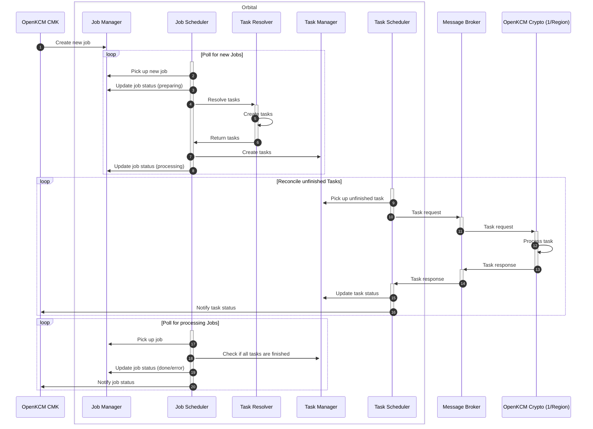

---
authors:
  - Nicolae Nicora
---
# OpenKCM – CMK L1 to L2 Event Processing

## Table of Contents
1. [Context](#1-context)
2. [Introduction](#2-introduction)
3. [Guarantees for Consumers](#3-guarantees-for-consumers)
4. [Reconciliation Mechanism](#4-reconciliation-mechanism)
    - [Sequence Diagram](#sequence-diagram)
5. [Jobs](#5-jobs)
    - [Jobs Table Structure](#jobs-table-structure)
6. [Tasks](#6-tasks)
    - [Tasks Table Structure](#tasks-table-structure)
7. [Job Types](#7-job-types)
    - [L1 Key Actions](#l1-key-actions)
    - [System Linking Actions (L2)](#system-linking-actions-l2)
8. [Example Job Payloads](#8-example-job-payloads)
9. [Communication CMK ⇄ Crypto](#9-communication-cmk--crypto)
10. [Example Reconciliation Flows](#10-example-reconciliation-flows)
11. [Use Cases](#11-use-cases)
12. [References](#12-references)

## 1. Context
This document describes the communication between the **OpenKCM CMK (Customer Managed Key)** instance and the **OpenKCM Crypto** component, as well as interactions with the central **CMK Registry**.

## 2. Introduction
OpenKCM CMK communicates with OpenKCM Crypto whenever:

- A key action is triggered via the CMK UI.
- A system is linked to or unlinked from an L1 key.

Affected OpenKCM Crypto instances perform requested changes, such as enabling, disabling, or deleting keychains based on the L1 key or linking/unlinking a system. They also announce or terminate L2 keys to/from the CMK Registry.

## 3. Guarantees for Consumers
- **Consumer**: OpenKCM Crypto
- **Delivery guarantees**: At least once
    - Normal case: message delivered once
    - Rare case: message may be delivered more than once (e.g., disaster recovery or deployment issues)

## 4. Reconciliation Mechanism
Reconciliation ensures that the desired state of L1 key actions and system–L1 key linking is eventually reached across all affected components.

- Uses the **`orbital`** library for distributed state reconciliation via a message broker or API.
- Key components:
    - **Job Manager**: Creates and manages jobs
    - **Job Scheduler**: Processes jobs and triggers the Task Resolver
    - **Task Resolver**: Resolves jobs into one or multiple tasks
    - **Task Manager**: Manages tasks created by the scheduler
    - **Task Scheduler**: Processes tasks, sends them to OpenKCM Crypto, and receives responses

Tasks are reconciled based on **status** and optional **workingState**. A **reconcileAfterSec** can delay re-sending the task for the next reconciliation cycle.

Lifecycle hooks allow clients to react to task or job completion events.

### Sequence Diagram



## 5. Jobs

- Represent key actions or system–L1 key linking events.
- Stored in the `jobs` table in a separate DB schema.
- The `orbital` library ensures jobs are reliably created and processed.

### Jobs Table Structure

| Column       | Type   | Description |
|--------------|--------|-------------|
| id           | UUID   | Unique identifier |
| data         | byte[] | Payload (L1 key or system info) |
| type         | string | Job type (`L1_ENABLE`, `L2_LINK`, etc.) |
| status       | string | `NEW`, `PROCESSING`, `DONE`, `ERROR` |
| created_at   | int    | Epoch creation time |
| updated_at   | int    | Epoch update time |

---

## 6. Tasks

- Each job can produce multiple tasks.
- Tasks are stored in the `tasks` table (separate DB schema).
- Task Scheduler sends tasks to OpenKCM Crypto and processes responses.

### Tasks Table Structure

| Column              | Type   | Description |
|--------------------|--------|-------------|
| id                  | UUID   | Unique identifier |
| job_id              | UUID   | Associated job |
| type                | string | Task type (`L1_ENABLE`, `L2_LINK`, etc.) |
| data                | byte[] | Payload |
| target              | string | Routing info (not sent to consumer) |
| working_state       | byte[] | Optional state from previous response |
| last_sent_at        | int    | Last sent epoch time |
| sent_count          | int    | Number of times task sent |
| reconcile_after_sec | int    | Delay before next send |
| etag                | string | Response alignment |
| status              | string | `NEW`, `PROCESSING`, `DONE`, `ERROR` |
| created_at          | int    | Creation epoch time |
| updated_at          | int    | Update epoch time |

---

## 7. Job Types

### L1 Key Actions

| Type       | Description |
|------------|------------|
| L1_ENABLE  | Enable key (encrypt/decrypt possible) |
| L1_DISABLE | Disable key (only decrypt possible) |
| L1_DELETE  | Delete key (no operations possible) |
| L1_ROTATE  | Rotate key material |
| L1_SWITCH  | Change primary key in configuration |

### System Linking Actions (L2)

| Type       | Description |
|------------|------------|
| L2_LINK    | Link system to L1 key |
| L2_UNLINK  | Unlink system from L1 key |
| L2_SWITCH  | Switch system to another L1 key |

---

## 8. Example Job Payloads

**L1_ENABLE**

```json
{
  "crypto_regions": ["eu10","us10"],
  "cmk_tenant_id": "TenantID1",
  "cmk_region": "emea"
}
```

**L2_LINK**

```json
{
  "crypto_region": "eu10",
  "system_id": "SystemID1",
  "system_type": "system",
  "l1_key_id_to": "L1KeyID1",
  "l1_key_info": {
    "l1_key_store_provider": "AWS",
    "aws_key_details": {
      "key_arn": "arn:aws:kms:eu-west-1:123456789012:key/abcd1234",
      "trust_anchor_arn": "arn:aws:kms:eu-west-1:123456789012:trust-anchor/abcd1234",
      "profile_arn": "arn:aws:kms:eu-west-1:123456789012:profile/abcd1234",
      "role_arn": "arn:aws:kms:eu-west-1:123456789012:role/abcd1234"
    }
  },
  "cmk_tenant_id": "TenantID1",
  "cmk_region": "emea"
}
```

---

## 9. Communication CMK ⇄ Crypto

- **Task Requests**: CMK → Crypto (via message broker)
- **Task Responses**: Crypto → CMK (via queues)
- **Priority Queues**: `L1_DELETE` tasks processed first
- **Protobuf Interfaces**: TaskRequest, TaskResponse, L1Action, L2Link

### TaskRequest Example

```protobuf3
message TaskRequest {
  string taskId = 10;
  string type = 20;
  optional bytes data = 30;
  bytes workingState = 40;
  string etag = 50;
}
```

### TaskResponse Example

```protobuf3
message TaskResponse {
  string taskId = 10;
  string type = 20;
  optional bytes workingState = 30;
  string etag = 40;
  TaskStatus status = 50;
  optional string errorMessage = 60;
  int64 reconcileAfterSec = 70;
}

enum TaskStatus {
  PROCESSING = 0;
  DONE = 1;
  ERROR = 2;
}
```

---

## 10. Example Reconciliation Flows

### L1_ENABLE (successful at once)

```json
Request: { "taskId": "...", "type": "L1_ENABLE", "data": { "l1_key_id": "L1KeyID1", ... } }
Response: { "status": "DONE", "reconcileAfterSec": 0 }
```

### L2_LINK (requires multiple reconciliation cycles)

```json
Response 1: { "status": "PROCESSING", "workingState": { "ks_internal_state": "foo" }, "reconcileAfterSec": 3600 }
Response 2: { "status": "PROCESSING", "workingState": { "ks_internal_state": "bar" }, "reconcileAfterSec": 3600 }
Response 3: { "status": "DONE", "workingState": "", "reconcileAfterSec": 0 }
```

### L2_UNLINK (error on second response)

```json
Response 2: { "status": "ERROR", "workingState": { "ks_internal_error": "error at unlink" }, "errorMessage": "error at unlink" }
```

---

## 11. Use Cases

- **L1 Key Actions**: Enable, disable, rotate, delete keys via CMK UI
- **System–L1 Linking**: Link, unlink, switch systems to different keys
- **Primary Key Changes**: Re-encrypt all linked L2 keys
- **L2 Announcements**: Notify Registry Service of new systems
- **L2 Termination**: Update Registry Service to `STATUS_TERMINATED`

---

## 12. References

- Orbital library documentation
- OpenKCM CMK and Crypto design
- Proto definitions for TaskRequest, TaskResponse, L1Action, L2Link
- Sequence diagrams in document