```mermaid
flowchart TD

    %% Definitions
    L1_plaintext([L1 Key<br/>🟩 Plaintext]):::green
    L2_ciphertext([L2 Key<br/>🟥 Wrapped by L1]):::red
    L2_plaintext([L2 Key<br/>🟩 Plaintext]):::green
    L3_ciphertext([L3 Key<br/>🟥 Wrapped by L2]):::red
    L3_plaintext([L3 Key<br/>🟩 Plaintext]):::green
    L4_plaintext([L4 DEK<br/>🟩 Plaintext]):::green
    L4_ciphertext([L4 DEK<br/>🟥 Wrapped by L3]):::red

    %% Flow
    L1_plaintext -->|wraps| L2_ciphertext
    L2_ciphertext -->|unwraps to| L2_plaintext
    L2_plaintext -->|wraps| L3_ciphertext
    L3_ciphertext -->|unwraps to| L3_plaintext
    L3_plaintext -->|wraps| L4_ciphertext
    L4_ciphertext -->|unwraps to| L4_plaintext

    %% Styles
    classDef green fill:#b7f7b7,stroke:#2d7a2d,stroke-width:2px,color:#000;
    classDef red fill:#f7b7b7,stroke:#7a2d2d,stroke-width:2px,color:#000;
```

---
authors:
  - Nicolae Nicora
---

# OpenKCM Crypto Keychain Management (L1 → L4)

**Status:** Proposed  
**Date:** 2025-11-27  
**Technical Story:** Keychain cryptographic isolation for multi-tenant SaaS

---

## Context

Today every application typically receives a single encryption key from OpenKCM Crypto for encrypting its data at rest.

OpenKCM is a **multi-layer keychain architecture** that supports:

- Customer-controlled top-level trust
- Tenant → service → data cryptographic separation
- Multi-cloud keystore flexibility
- Frequent low-level key rotation
- External KMS/HSM integration
- KMIP interoperability

OpenKCM offer a secure, multi-layered key management system:

- Support **multi-tenant** SaaS deployments
- Integrate with **multi-cloud keystores** (AWS KMS, GCP KMS, Azure Vault)
- Support **BYOK, HYOK, and CYOK/MYOK key models**
- Provide **ephemeral crypto at the edge**
- Enable **flexible MasterKey lifecycle management** using Shamir Secret Sharing (SSS) or Seal auto-unseal
- Ensure **auditability, rotation, and compliance**

The system is protecting keys at different layers:

| Layer    | Role                      | Scope                          |
|----------|---------------------------|--------------------------------|
| L1       | Customer Master Key (CMK) | Tenant root/global             |
| L2(L2.1) | Tenant Encryption Key     | Per-tenant                     |
| L3       | Service Encryption Key    | Per-service                    |
| L4       | Crypto Edge Key           | Ephemeral, per request/session |

---

## Decision

We is implementing a **four-level hierarchical keychain** (L1 → L4) using envelope encryption, where each parent key encrypts its child key:

- **L1:** Customer Root Key Domain
- **L2:** Tenant Key Domain
- **L3:** Service/Application Key Domain
- **L4:** Data Encryption Key Domain

Additionally:

1. **MasterKey lifecycle** will support both:
    - **Shamir Secret Sharing (SSS)**: MasterKey split into N shards, M required to reconstruct; shards encrypted with multiple keystores.
    - **Seal Auto-Unseal**: MasterKey encrypted in single KMS/HSM; system requests decryption at startup.

    

2. **OpenKCM will integrate with multiple keystores**:
    - AWS KMS, Azure Key Vault, GCP KMS
    - HSMs (Thales, SafeNet, Utimaco)
    - Vault / OpenBao
    - Customer-provided external keys

3. **KMIP server interface** will expose:
    - `Create`
    - `Get`
    - `Encrypt`
    - `Decrypt`
    - `etc...`

4. **Key Strategy**:
    - L1: Root CMK stored in external KMS/HSM per customer
    - L2: Tenant keys encrypted with L1. 
      Kept plaintext temporarily in memory for encrypt/decrypt L3 keys, is not persisted anywhere in as plaintext payload.
    - L2.1: Same L2 tenant key encrypted with internal versioned rotated key. (is persisted on a storage)
    - L3: Service-level keys encrypted by L2
    - L4: ephemeral rotation per session/request

5. **Support for** BYOK, HYOK, CYOK, MYOK.

---

## Keychain Definition

A **keychain** is a hierarchical tree in which:

- Each parent key encrypts/wraps its child key
- Child keys can be re-encrypted when a parent rotates
- Keychain depth is flexible
- Envelope encryption is used for wrapping
- Green keys = plaintext payload - applicable for L2 Key only and OpenKCM Crypto MasterKey
- Red keys = encrypted key references

This enables separation of duties, multi-tenant isolation, and customer sovereignty.

To visually distinguish the state and security posture of keys within the OpenKCM Crypto keychain.

- 🟩 **Green keys** represent *plaintext key material* (actual cryptographic keys).
- 🟥 **Red keys** represent *encrypted key references* (wrapped keys).

This helps clearly identify *where sensitive plaintext exists* and *where only safe, encrypted key blobs are handled*.

---

### 🟩 Green Keys — Plaintext Key Material (Payload)

A **green key** represents **a real cryptographic key in plaintext form**, only present in secure, trusted memory.

#### Properties
- Contains the actual secret key bits.
- Only exists inside secure compute environments:
    - HSMs
    - Cloud KMS runtime memory
    - Trusted enclaves
    - Client-side key generators
    - Server Side  Cache in memory
- Never persisted or transmitted in plaintext.
- Used for:
    - Encrypt/decrypt operations
    - Wrapping child keys
    - Key rotation

#### Examples
- An L4 Data Encryption Key (DEK) generated on the client.
- An L3 key after being unwrapped in memory within KMS.
- The L2 tenant key while performing key rotation.

---

### 🟥 Red Keys — Encrypted Key References (Wrapped Keys)

A **red key** represents **encrypted key material** — a ciphertext blob referencing the true key, which can only be
decrypted by its parent key.

#### Properties
- Safe to store, back up, transmit.
- Cannot be used for crypto operations until unwrapped.
- Encodes the lineage of the keychain (child wrapped by parent).

#### Examples
- L3 key wrapped with L2.
- L2 key wrapped with L1.
- Encrypted L4 DEK stored next to application data.
- Any key blob stored in the OpenKCM database.

---

---

## Detailed Key Model

### L1 – Root Key Domain (Customer-Controlled)

- **KMS HSM Root Key**
- **Optional offline HSM root**
- **L1 Default Root Key** 

Properties:

- Stored only in external KMS/HSM
- Never stored inside OpenKCM
- Wraps L2 tenant keys
- Provides full customer sovereignty

---

### L2 / L3 – OpenKCM Crypto Domain

#### OpenCMK Crypto Master Key
- Never persisted as a whole (Shamir splits only or Seal Key)
- Kept in memory only, generated at startup
- Used to encrypt internal versioned keys

#### OpenCMK Crypto Internal Versioned Keys
- Root of L2 domain
- Periodically rotated 
- Wrapped/UnWrapped by OpenCMK Crypto Master Key

#### L2 – Tenant Key
- Unique per **(LoB Tenant/Customer)**
- Encrypts L3 keys
- Wrapped by an internal versioned key
- Wrapped by L1 for export

#### L3 Keys
- Unique per **(Service/Application)**
- Used for L4 DEK operations

---

### L4 – Data Encryption Keys (DEKs)

1. *Scenario 1:* Generated and kept on client side
   - Generated by customer applications
   - Stored client-side in metadata or app storage
   - Encrypt actual data
   - Wrapped with L3 keys
   

2. *Scenario 2:* Generated and kept on OpenKCM Crypto Edge side
    - Generated by OpenKCM Crypto Edge
    - Stored OpenKCM Crypto Edge storage
    - Retried by client to encrypt/decrypt actual data
    - Wrapped with L3 keys

**Consequences**

- Multi-layered security reduces risk of key compromise.
- Operational complexity increases due to hierarchical rotations and shard management.
- Multi-cloud integration ensures resilience but requires careful IAM/ACL setup.
- Requires monitoring and audit logging for each layer.
- MasterKey management choice affects operational workflows:
    - SSS: manual recovery required
    - Seal: relies on availability of external KMS/HSM

