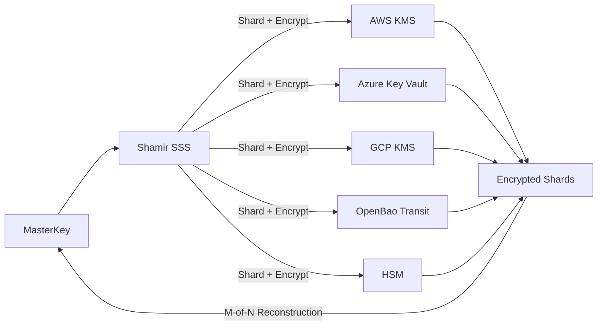

---
authors:
  - Nicolae Nicora
---

# OpenKCM Crypto - MasterKey Management (Shamir SSS & Seal)

**Status:** Proposed  
**Date:** 2025-12-03


## Context
The MasterKey is the root OpenKCM Crypto internal secret used to encrypt:
- Internal versioned key for L2 tenant keys
- Internal cryptographic material

The MasterKey must:
- Never be stored in plaintext
- Support **Shamir Secret Sharing** for regulated customers
- Support **Seal/Auto-Unseal** for cloud-native deployments
- Survive multi-cloud outages
- Provide deterministic recovery workflows

---

## Decision
OpenKCM will support **two MasterKey lifecycle modes**:

---

### **1. Shamir Secret Sharing (SSS) Mode**
Used for:
- Regulated industries (banking, defense, healthcare)
- Multi-cloud independence  
- Manual recovery with quorum control

Properties:
- MasterKey split into **N shards**
- Reconstruction requires **M shards**
- Each shard encrypted by a different keystore:
  - AWS KMS  
  - Azure Key Vault  
  - GCP KMS  
  - Thales/Ncipher HSM  
  - OpenBao/Vault Transit  
- Each encrypted shard is stored in the DB (never plaintext)
- Created using **M shards** at service startup

---

### **2. Seal / Auto-Unseal Mode**
Used for:
- Cloud-native SaaS  
- Fully automated startup  
- Stateless deployments (K8s)

Properties:
- MasterKey is encrypted using:
  - AWS KMS
  - Azure Key Vault
  - GCP KMS
  - HSM (PKCS#11)
  - OpenBao/Vault Seal
- Encrypted blob stored in DB
- Automatically decrypted on service startup

---

## Architecture Diagrams


### SSS Mode



### Seal Mode

```mermaid
flowchart LR
    MK[MasterKey]
    SEAL[Seal Provider (AWS/Azure/GCP/HSM/OpenBao)]
    DB[(Encrypted MasterKey Blob)]

    MK -->|Encrypt| SEAL --> DB
    DB -->|Decrypt at startup| SEAL --> MK
```


#Consequences

- **Benefits**
  - Supports both highly regulated environments and cloud-native SaaS 
  - MasterKey never stored in plaintext 
  - SSS provides multi-cloud and offline resilience 
  - Seal provides automatic startup and operational simplicity

- **Drawbacks**
  - SSS introduces operational overhead — key ceremonies required 
    Seal relies on a single keystore availability