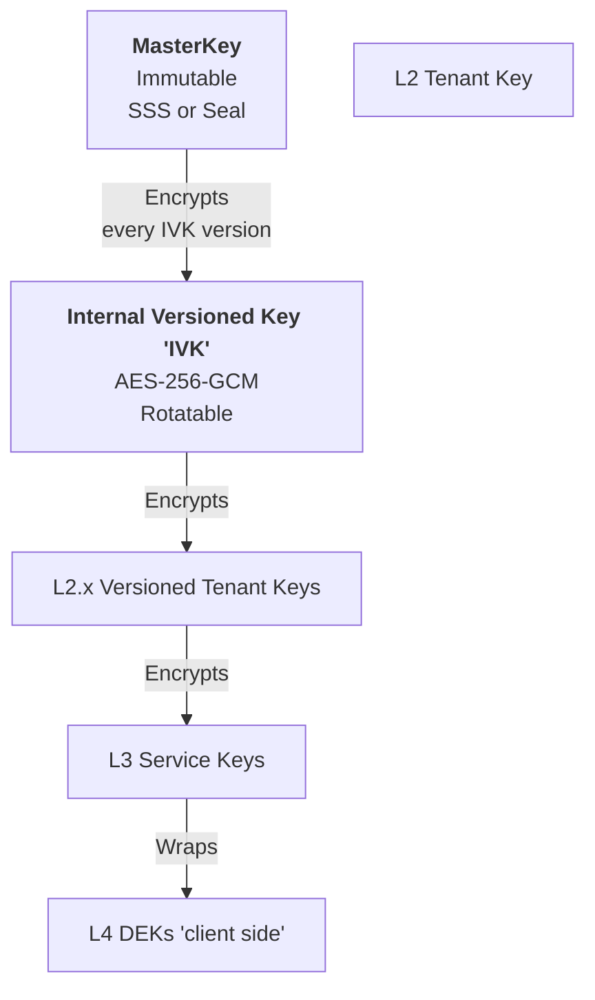
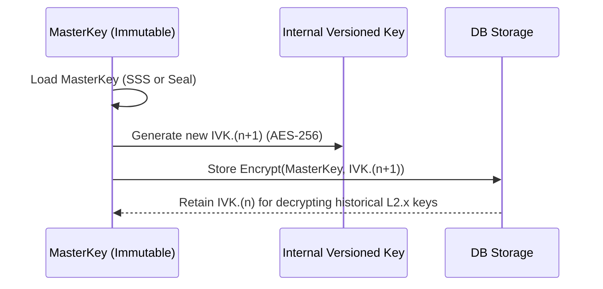
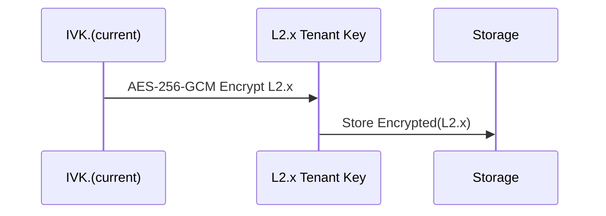
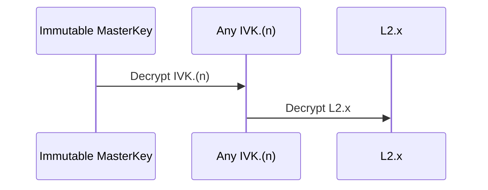

---
authors:
  - Nicolae Nicora
---

# OpenKCM Crypto - Internal Versioned Symmetric Key for Encrypting Tenant L2 Keys

**Status:** Accepted  
**Date:** 2025-12-03

## Context

OpenKCM Crypto requires a secure internal mechanism to protect **tenant-specific L2 keys**, which define the cryptographic boundary separating one customer's data from another.

These L2 keys **must never be stored in plaintext** and must be encrypted under a **stable internal key** with the following properties:

- Owned and managed by OpenKCM Crypto (not by customers)
- High-security and never exposed in plaintext
- Supports **periodic rotation** to create new IVK versions for forward security
- Supports encryption/decryption of multiple **Internal Versioned Key (IVK) versions**
- Compatible with **SSS (Shamir Secret Sharing)** and **Seal / auto-unseal** deployment modes
- Enables **tenant-specific L2.x key rotation** independent of the MasterKey
- Avoids dependency on customer-managed keys (cannot rely on L1 BYOK keys)

To satisfy these requirements, OpenKCM introduces the **Internal Versioned Key (IVK)**, which is used exclusively to encrypt all tenant L2.x keys.

The **MasterKey** serves as the immutable root of trust and is used to encrypt/decrypt all IVK versions. Rotating the MasterKey would invalidate all IVK-encrypted keys and compromise deployment stability. Therefore:

> **MasterKey MUST NEVER rotate.  
> It is a stable root key for the lifetime of the deployment.**

## Decision

We introduce an **Internal Versioned Symmetric Key (IVK)** with the following properties:

- Symmetric AES-256-GCM key
- Supports **multiple versions**: IVK.1, IVK.2, IVK.3, …
- Exclusively used to **encrypt and decrypt tenant L2.x keys**
- Stored only in **encrypted form**; never in plaintext
- Always encrypted under the **non-rotating MasterKey**
- All IVK versions remain decryptable as long as the MasterKey exists
- Allows **independent rotation** of L2.x and L3.x keys without breaking data access

The MasterKey is produced and maintained via:

- **Shamir Secret Sharing (SSS) reconstruction**, or
- **Seal / Auto-Unseal** mechanisms

…and **remains immutable** throughout the deployment to provide a consistent root-of-trust for the entire system.

## Architecture Overview

### Key Hierarchy and Rotation Boundaries

## Storage Model

The storage and encryption boundaries for each key type are summarized below:

| Key        | Type      | Stored As               | Encrypted By | Rotation   | Notes                       |
|------------|-----------|------------------------|--------------|------------|-----------------------------|
| MasterKey  | Symmetric | Encrypted blob / SSS shards | External KMS/HSM | Never      | Immutable for entire deployment |
| IVK.n      | Symmetric | Encrypted blob          | MasterKey    | Yes        | Rotated periodically         |
| L2.x       | Symmetric | Encrypted blob          | IVK.n        | Yes        | Per-tenant                   |
| L3.x       | Symmetric | Encrypted blob          | L2.x         | Yes        | Per-service                  |
| L4 (DEK)   | Symmetric | Wrapped value           | L3.x         | Ephemeral  | Client-side data encryption  |

## IVK Generation and Rotation

## Encrypting and Decrypting L2.x Keys

### Encrypting an L2.x Tenant Key

### Decrypting Past L2.x Keys

Regardless of which IVK version encrypted it:

## Consequences
   
**Benefits**

- MasterKey remains stable, ensuring:
  - Predictable recovery 
  - Long-term system integrity 
  - No cascading re-encryption 
- IVK can rotate without customer impact 
- Proper separation of duties:
  - MasterKey = system root 
  - IVK = L2 protection 
  - L2 = per-tenant isolation 
  - L3 = per-service isolation 
- Compatible with Seal, SSS, HSM, Vault/OpenBao

**Trade-Offs**

- Must maintain full version metadata 
- IVK rotation requires decrypting L2.x during rotation 
- Requires careful lifecycle management

## Alternatives Considered

❌ Reject Rotation of the MasterKey
  - Would require re-encrypting all IVK versions 
  - Which would require re-encrypting all L2.x keys 
  - Which would require re-encrypting all L3.x keys 
  - Which would break all DEKs and stored ciphertexts

> **MasterKey must remain immutable.**

❌ Store IVK without encryption
- Rejected for obvious security reasons.

❌ Reject usage of customer L1 to encrypt the L2 as plaintext
- Rejected because OpenKCM must remain functional and secure independently of customer key availability.