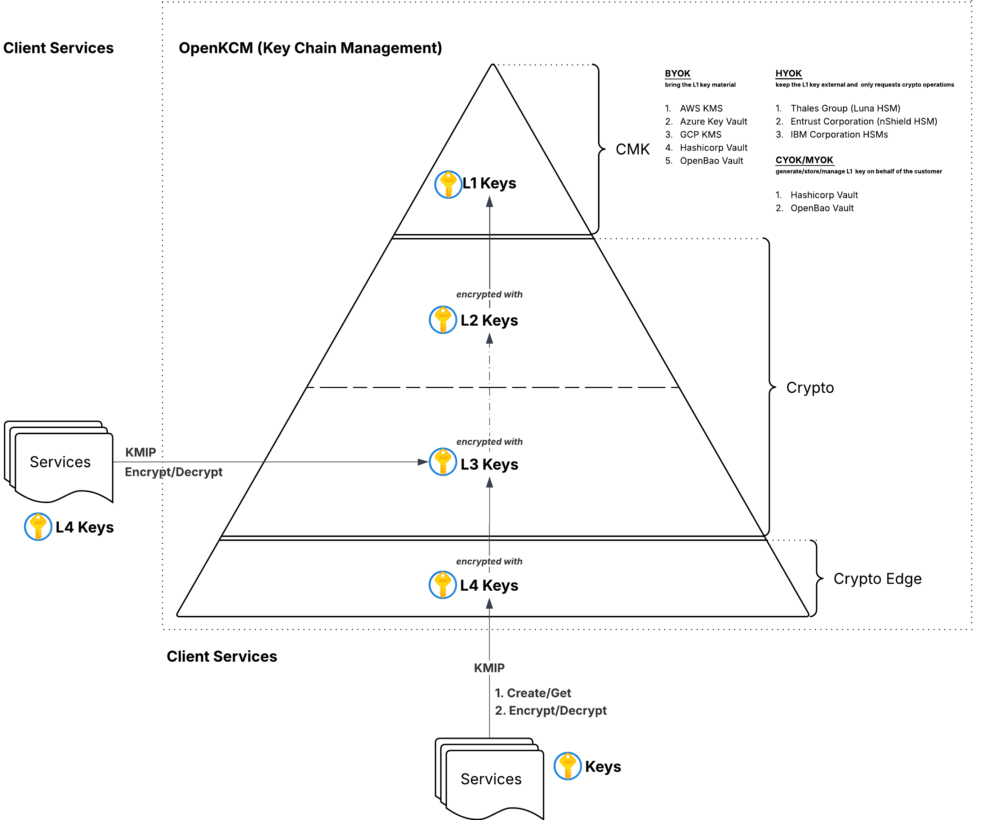
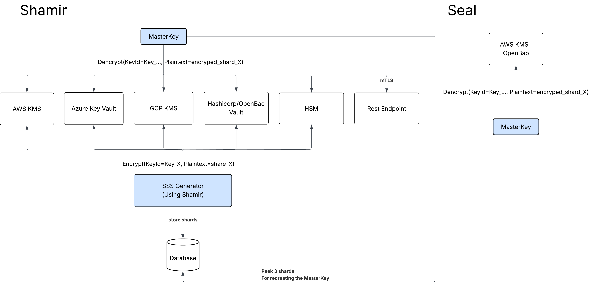
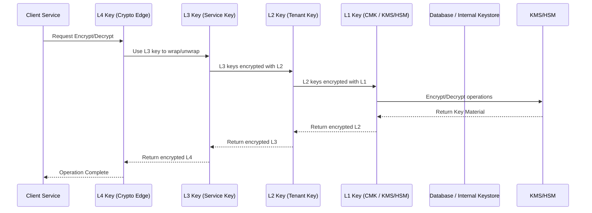

---
authors:
  - NicolaeNicora # Change to your own handle. Add yourself to "authors.yml" if necessary.
---

# Hierarchical Key Management CMK and Crypto

OpenKCM requires a secure, multi-layered key management system to:

- Support **multi-tenant** SaaS deployments
- Integrate with **multi-cloud keystores** (AWS KMS, GCP KMS, Azure Vault)
- Support **BYOK, HYOK, and CYOK/MYOK key models**
- Provide **ephemeral crypto at the edge**
- Enable **flexible MasterKey lifecycle management** using Shamir Secret Sharing (SSS) or Seal auto-unseal
- Ensure **auditability, rotation, and compliance**

The system must protect keys at different layers:

| Layer    | Role                      | Scope                          |
|----------|---------------------------|--------------------------------|
| L1       | Customer Master Key (CMK) | Tenant root/global             |
| L2(L2.1) | Tenant Encryption Key     | Per-tenant                     |
| L3       | Service Encryption Key    | Per-service                    |
| L4       | Crypto Edge Key           | Ephemeral, per request/session |

**Related diagrams:**

## Key Chaim – L1→L4

## Detailed Key Flow

## Crypto MasterKey Management

---

## Decision
We decided to implement **OpenKCM (Key Chan Management)** with the following design:

1. **Hierarchical Key Layers (L1 → L4)**
    - L1: Root CMK stored in external KMS/HSM
    - L2: Tenant keys encrypted with L1
    - L2.1: Tenant versioned keys for rotation/rollback
    - L3: Service-level keys encrypted by L2.1 or L2
    - L4: Ephemeral keys at crypto edge, encrypted by L3

2. **MasterKey Lifecycle Options**
    - **Shamir Secret Sharing (SSS)**: MasterKey split into N shards, M required to reconstruct; shards encrypted with multiple keystores.
    - **Seal Auto-Unseal**: MasterKey encrypted in single KMS/HSM; system requests decryption at startup.

3. **Multi-Keystore Integration**
    - AWS KMS, Azure Key Vault, GCP KMS, HSMs, Vault/OpenBao
    - BYOK/HYOK/CYOK support

4. **KMIP Integration**
    - L4 keys exposed to client services via KMIP:
        - `Create/Get`
        - `Encrypt/Decrypt`

5. **Rotation Strategy**
    - L1: Per external KMS policy
    - L2: Tenant lifecycle-based
    - L2.1: Versioned rotation
    - L3: Service deployment or security event
    - L4: Ephemeral rotation per session/request

---

## Rationale
- **Hierarchical keys** provide clear separation of duties and controlled propagation.
- **Shamir Secret Sharing** allows multi-cloud resilience and no single point of failure.
- **Seal** enables automated unseal for cloud-native deployments.
- **KMIP** ensures client-side crypto is consistent and ephemeral.
- **Internal versioned keys (L2.1)** allow rotation and rollback without disrupting dependent keys.
- Flexibility to integrate with multiple keystores supports compliance (FIPS, PCI DSS, SOC2).

---

## Alternatives Considered
| Alternative | Pros | Cons | Decision |
|------------|------|------|---------|
| Single-layer key management | Simple | No isolation, higher risk | Rejected |
| Only Shamir SSS for MasterKey | High security | Operationally complex | Use selectively |
| Only Seal Auto-Unseal | Fully automated | Single keystore dependency | Use for cloud-native deployments |
| Per-service L1 keys | Isolation | Complex rotation, high cost | Rejected |

---

## Consequences
- Multi-layered security reduces risk of key compromise.
- Operational complexity increases due to hierarchical rotations and shard management.
- Multi-cloud integration ensures resilience but requires careful IAM/ACL setup.
- Requires monitoring and audit logging for each layer.
- MasterKey management choice affects operational workflows:
    - SSS: manual recovery required
    - Seal: relies on availability of external KMS/HSM

---

## Security Considerations
- Access control enforced per layer
- Audit logging at all key operations
- Separation of duties: L1 operators cannot access L4
- Encryption and key rotation monitored
- Multi-cloud key storage for redundancy

---

## Monitoring & Compliance
- Track key usage metrics, rotation status, and failed attempts
- Log all encryption/decryption events for audit
- Ensure compliance with FIPS 140-2, PCI DSS, SOC2 standards

---

## Sequence Diagram (Mermaid)

---

## References
- OpenKCM Pyramid Diagram (L1 → L4)
- Detailed Key Flow Diagram (L1/L2/L2.1/L3/L4)
- Shamir vs Seal MasterKey Workflow Diagram
- Cloud KMS & HSM best practices
- Shamir Secret Sharing (SSS) documentation
