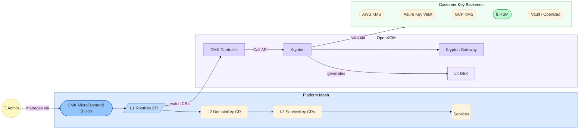
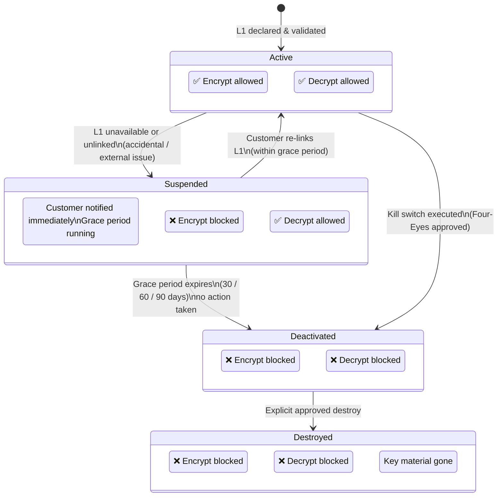
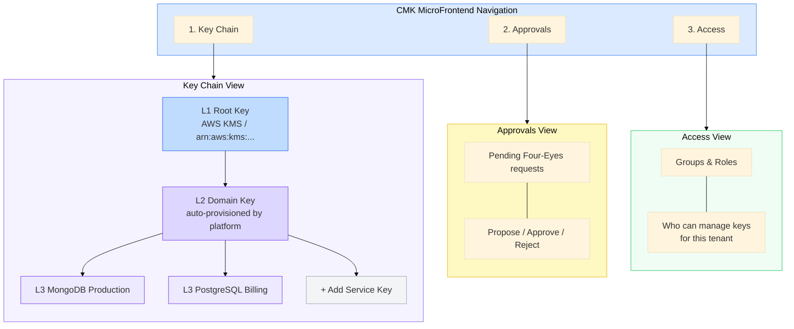

---
authors:
  - Aysan
status: Draft
last_updated: 2026-04-27
---

# CMK Controller: Visual Overview

---

## 1. Architecture: How It Works

Who owns what and how the pieces connect.

---

## 2. Customer Journey: Two Modes

How a customer goes from account creation to full sovereignty.

```mermaid
flowchart LR
    A[Account Created\nin Platform Mesh] --> B{Customer brings\nown key?}

    B -->|No| C[Mode A\nPlatform-Managed L1]
    C --> D[Krypton provisions\nL1 internally]
    D --> E[Encryption available\nimmediately]
    E --> F[No kill switch\nNo sovereignty]

    B -->|Yes| G[Mode B\nCustomer-Managed L1\nBYOK / HYOK]
    G --> H[Customer declares\nL1 reference on\nTenant CRD]
    H --> I[CMK Controller\ncalls Krypton\nto validate]
    I -->|Valid| J[Key transitions\nto Active]
    J --> K[Full sovereignty\nKill switch active\nFour-Eyes enabled]

    F -.->|upgrade at any time| G

    style C fill:#fff3e0,stroke:#FF9800
    style G fill:#e8f5e9,stroke:#4CAF50
    style F fill:#fff3e0,stroke:#FF9800
    style K fill:#e8f5e9,stroke:#4CAF50
```

---

## 3. Key Lifecycle: NIST States

How a key moves through its lifecycle and what each state means for the customer.

---

## 4. Before vs. After

What gets replaced and what stays.

```mermaid
flowchart LR
    subgraph Before ["Before: Standalone CMK"]
        B1[CMK API Server]
        B2[CMK Registry\nPostgreSQL]
        B3[CMK Approval Engine]
        B4[CMK RBAC]
        B5[CMK Audit DB\nPostgreSQL]
        B6[CMK Tenant Manager]
        B7[CMK Task Scheduler]
        B8[CMK Portal\nstandalone]
        B9[Event Bridge\nto Platform Mesh]
    end

    subgraph After ["After: CMK Controller"]
        A1[CMK Controller\n1 Kubernetes controller]
        A2[Tenant CRD\netcd]
        A3[Platform Mesh\nApproval]
        A4[Kubernetes RBAC]
        A5[Platform Mesh\nAudit Trail]
        A6[Platform Mesh\nPortal - Luigi]
    end

    Before -->|replaced by| After

    style Before fill:#ffebee,stroke:#F44336
    style After fill:#e8f5e9,stroke:#4CAF50
```

---

## 5. CMK MicroFrontend: Proposed UI Structure

Three sections replace five — Key Configurations and Systems are blended into a single Key Chain view.

